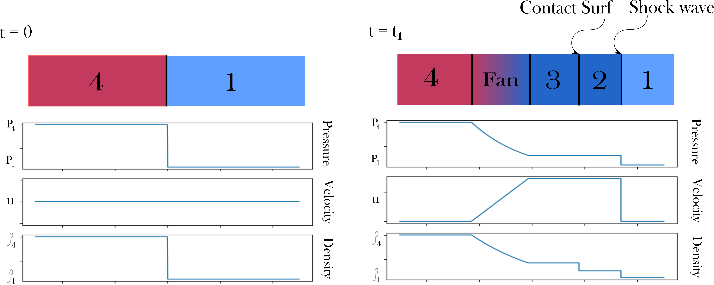

# McCormack-Scheme-for-Shock-Tube
The repository holds python code for solving the shock tube compressible flow problem using McCormack scheme for 1D with the same gas on both sides. Various grid sizes have been compared, a second order vs fourth order Gottlieb-Turkel scheme for differencing of Flux vector has been compared, various artificial viscosity coefficients have been compared and some different internal / external properties for the gas have been compared. 

Here's a coarse figure for the problem statement:

(This project was completed for the ME-840 Computational Fluid Dynamics course at Michigan State University in Spring 2024)
